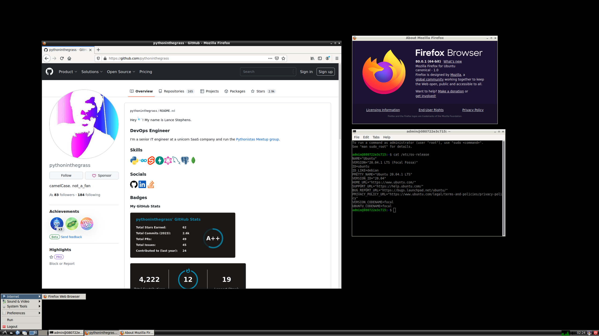
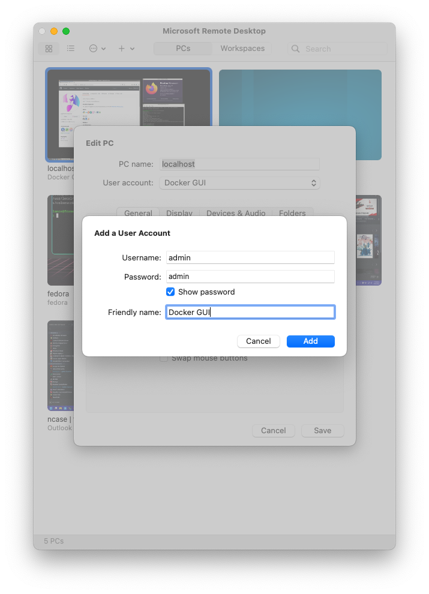

# docker_graphical

## Docker container with Firefox, SSH server, and RDP support



### Massive shoutout to the OG who created this lovely container: [@arktronic](https://github.com/arktronic) via [Doing terrible things with Docker | trycatch.dev](https://trycatch.dev/2020/09/08/doing-terrible-things-with-docker/)

> This container gives you a minimal GUI environment based on LXDE on top of Ubuntu, with some niceties thrown in. `supervisord` is used to control startup processes. A syslog daemon logs everything to Docker's logs. Cron is installed as well.
> 
> NOTE: You must use `--init` in order to have a stable running container. Otherwise, dead processes will not be reaped and you will eventually run out of resources.
> 
> To access remotely, either SSH or RDP into the container. **The username and password, by default, are both `admin`.**

## Quickstart:
* Start container with standard RDP and SSH ports exposed
    ```bash
    # start container with RDP port and n shared memory
    docker run -d -p 3389:3389 --init --shm-size=2g ghcr.io/pythoninthegrass/docker_graphical:latest
    ```
* Connect via RDP
  * Open MS Remote Desktop
  * Create a new connection
  * Set `hostname` as `localhost` (i.e., `127.0.0.1`)
  * Create new credentials
    * Default is 
      * **User**: `admin`
      * **Pass**: `admin`



* Connect via SSH
    ```bash
    # TODO
    ```

## TODO
* [Issues](https://github.com/pythoninthegrass/docker_graphical/issues)
* Finish [Quickstart](README.md#quickstart)
  * Currently doesn't work with default `22/tcp` port or `172.17.0.*` IP
  * Might need to explicitly add bridge network
* Update [Dockerfile](Dockerfile)
  * Bump OS to 22.04
  * `heredoc` vs. `RUN`
* ~~Add `compose.yml`~~
* [Pre-commit hooks](https://pre-commit.com/)
* Add `ansible` playbook for Ubuntu
